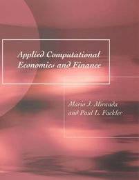
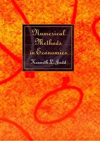

.. OSE Scientific Computing documentation master file, created by
   sphinx-quickstart on Tue Jul  7 07:15:41 2020.
   You can adapt this file completely to your liking, but it should at least
   contain the root `toctree` directive.

.. |logo| image:: https://raw.githubusercontent.com/OpenSourceEconomics/ose-corporate-design/master/logos/OSE_logo_no_type_RGB.svg
  :width: 4 %

|logo| OSE scientific computing
================================

.. image:: https://github.com/OpenSourceEconomics/ose-course-data-science/workflows/Continuous%20Integration/badge.svg
    :target: https://github.com/OpenSourceEconomics/ose-course-scientific-computing/actions

.. image:: https://img.shields.io/badge/code%20style-black-000000.svg
    :target: https://github.com/psf/black

.. image:: https://img.shields.io/badge/zulip-join_chat-brightgreen.svg
    :target: https://bonn-econ-teaching.zulipchat.com

.. image:: https://img.shields.io/badge/License-MIT-yellow.svg
    :target: https://github.com/OpenSourceEconomics/ose-course-scientific-computing/blob/master/LICENSE

.. image:: https://readthedocs.org/projects/ose-scientific-computing/badge/?version=latest
    :target: https://ose-scientific-computing.readthedocs.io

The sound analysis of computational economic models requires expertise in economics, statistics,
numerical methods, and software engineering. We first provide an overview of basic numerical methods
for optimization, numerical integration, approximation methods, and uncertainty quantification.
We then deepen our understanding of each of these topics in the context of a dynamic model of human
capital accumulation using `respy <https://respy.readthedocs.io>`_. We conclude by showcasing basic
software engineering practices such as the design of a collaborative and reproducible development
workflow, automated testing, and high-performance computing.

Students learn how to use `Python <https://www.python.org>`_ for advanced scientific computing.
They acquire a toolkit of numerical methods frequently needed for the analysis of computational
economic models, obtain an overview of basic software engineering tools such as
`GitHub <https://www.github.com>`_ and `pytest <https://docs.pytest.org>`_, and are exposed to
high-performance computing using
`multiprocessing <https://docs.python.org/3/library/multiprocessing.html>`_
and `mpi4py <https://mpi4py.readthedocs.io>`_.

We build the course on the `Nuvolos.cloud <https://nuvolos.cloud>`_ as an integrated research and
teaching platform. The platform provides a simple, browser-based environment that allows for
complete control over students’ computational environment and simplifies the dissemination of
teaching material. It enables students to seamlessly scale up their course projects from a
prototype to a high-performance computing environment.

.. toctree::
   :maxdepth: 1

   lectures/index
   iteration/lecture_plan_2020
   references/references

References
----------

|space| |space| |mirandafackler| |space| |juddnumeriacal| |space| |space|

.. bibliography:: references/references.bib
   :list: bullet
   :filter: (key == "miranda2004applied") or (key == "compecon") or (key == "judd1998numerical")

Powered by
----------

|space| |OSE| |space| |Nuvolos| |space| |TRA| |space|

.. |OSE| image:: _static/images/fig-ose.svg
  :width: 22 %
  :target: https://open-econ.org

.. |Nuvolos| image:: _static/images/fig-novolos.svg
  :width: 10 %
  :target: https://nuvolos.cloud

.. |space| raw:: html

     <embed>
   &nbsp; &nbsp; &nbsp; &nbsp; &nbsp; &nbsp; &nbsp; &nbsp; &nbsp;
     </embed>

We gratefully acknowledge funding by the Federal Ministry of Education and Research (BMBF) and the
Ministry of Culture and Science of the State of North Rhine-Westphalia (MKW) as part of the
Excellence Strategy of the federal and state governments.
